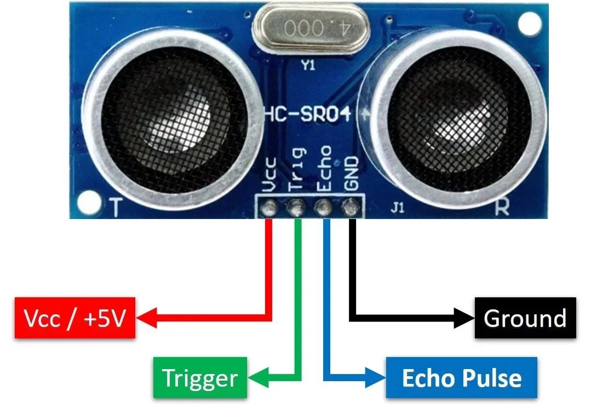
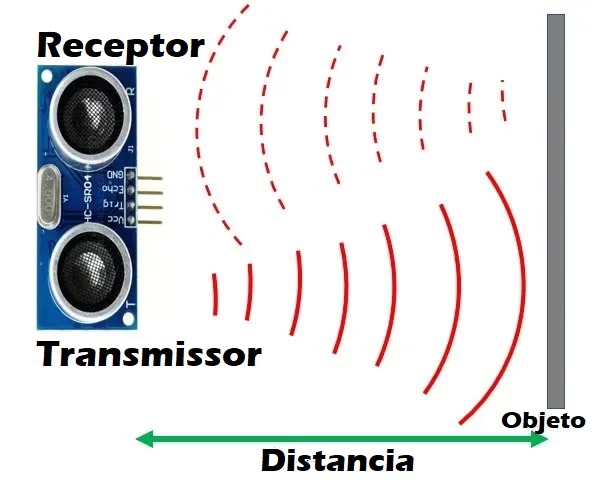
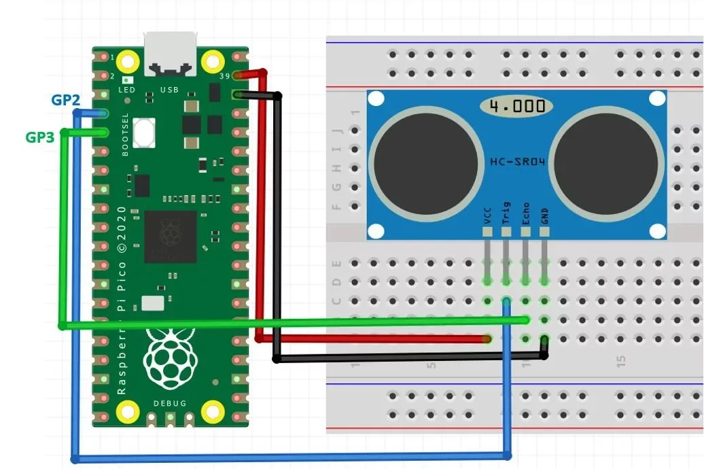
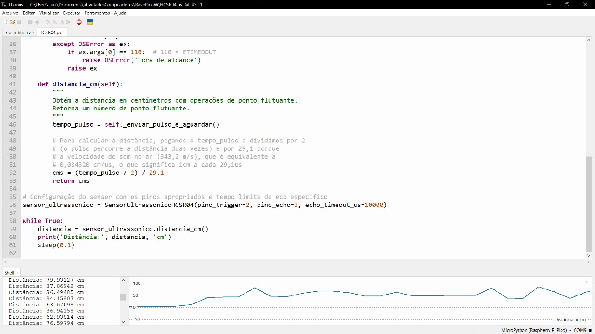
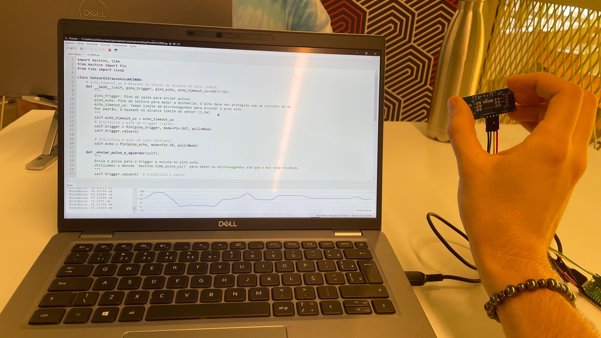

# Implementação de um Sistema de Comunicação Entre Computador e Sistema Embarcado

A presente documentação aborda a implementação do sensor ultrassônico (HC-SR04), com a finalidade de realizar medições de distância de forma integrada com o  Raspberry Pi Pico W. Para isso, foi desenvolvido um código em MicroPython no Thonny IDE, em que é possível visualizar uma interface gráfica para o usuário, onde as medições das distâncias pelo tempo é elucidada de forma intuitiva.

Sendo assim, cabe definir de forma mais precisa o método de funcionamento do Sensor HC-SR04 antes de demonstrar o fluxo da solução final.

Imagem 1: representação do sensor HC-SR04.

Como pode-se observar, o sensor ultrassônico possui 4 pinos principais, sendo eles o pino de voltagem de 5V, terra, o gatilho, que consiste no pino de entrada que inicia o sensor ultrassônico por meio do envio de um pulso curto que gera uma onda eletromagnética, e o eco, que é o pino de saída que é responsável por emitir um pulso com duração proporcional à distância percorrida pela onda inicial. De forma mais clara, é possível compreender o funcionamento do sensor pela seguinte imagem:

Imagem 2: representação do funcionamento do sensor HC-SR04.

Ou seja, por meio da medicação do tempo em que a onda eletromagnética sai e retorna para o sensor é possível calcular a distância que o objeto se encontra do sensor, tendo em vista que a velocidade do som é conhecida e a física se vale da igualdade: distância = velocidade vezes tempo. Tal conta está incorporada no código e é dessa forma que o sensor funciona.

Logo, é necessário explicitar a forma com que o sensor se conecta ao Raspberry Pi Pico W, como vê-se na imagem a seguir:

Imagem 3: conexão do sensor HC-SR04 com o Raspberry Pi Pico W

Após a conexão, o seguinte programa é incorporado ao Raspberry para possibilitar o funcionamento do sensor:

    import machine, time
    from machine import Pin
    from time import sleep

    class SensorUltrassonicoHCSR04:
        # echo_timeout_us é baseado no limite de alcance do chip (150cm)
        def __init__(self, pino_trigger, pino_echo, echo_timeout_us=500*2*30):
            """
            pino_trigger: Pino de saída para enviar pulsos
            pino_echo: Pino de leitura para medir a distância. O pino deve ser protegido com um resistor de 1k
            echo_timeout_us: Tempo limite em microssegundos para escutar o pino echo.
            Por padrão, é baseado no alcance limite do sensor (1,5m)
            """
            self.echo_timeout_us = echo_timeout_us
            # Inicializa o pino de trigger (saída)
            self.trigger = Pin(pino_trigger, mode=Pin.OUT, pull=None)
            self.trigger.value(0)

            # Inicializa o pino de echo (entrada)
            self.echo = Pin(pino_echo, mode=Pin.IN, pull=None)

        def _enviar_pulso_e_aguardar(self):
            """
            Envia o pulso para o trigger e escuta no pino echo.
            Utilizamos o método `machine.time_pulse_us()` para obter os microssegundos até que o eco seja recebido.
            """
            self.trigger.value(0)  # Estabiliza o sensor
            time.sleep_us(5)
            self.trigger.value(1)
            # Envia um pulso de 10us.
            time.sleep_us(10)
            self.trigger.value(0)
            try:
                tempo_pulso = machine.time_pulse_us(self.echo, 1, self.echo_timeout_us)
                return tempo_pulso
            except OSError as ex:
                if ex.args[0] == 110:  # 110 = ETIMEDOUT
                    raise OSError('Fora de alcance')
                raise ex

        def distancia_cm(self):
            """
            Obtém a distância em centímetros com operações de ponto flutuante.
            Retorna um número de ponto flutuante.
            """
            tempo_pulso = self._enviar_pulso_e_aguardar()

            # Para calcular a distância, pegamos o tempo_pulso e dividimos por 2
            # (o pulso percorre a distância duas vezes) e por 29,1 porque
            # a velocidade do som no ar (343,2 m/s), que é equivalente a
            # 0,034320 cm/us, o que significa 1cm a cada 29,1us
            cms = (tempo_pulso / 2) / 29.1
            return cms

    # Configuração do sensor com os pinos apropriados e tempo limite de eco específico
    sensor_ultrassonico = SensorUltrassonicoHCSR04(pino_trigger=2, pino_echo=3, echo_timeout_us=10000)

    while True:
        distancia = sensor_ultrassonico.distancia_cm()
        print('Distância:', distancia, 'cm')
        sleep(0.1)

De forma aplicada, é possível obter a seguinte visualização gráfica para o usuário na parte inferior da imagem:

Imagem 4: demonstração da interface para o usuário.

E aplicando no mundo real o código, podemos ver sua aplicação e funcionamento no [vídeo](https://drive.google.com/file/d/1nderVWFbFh5oDPzJrh0DHYFe4yAVXYzr/view?usp=sharing), em que é nítida a conexão entre o computador e o sistema embarcado. De forma mais simples, a imagem na sequência também evidencia essa conexão:

Imagem 5: demonstração no mundo real do Raspberry com o código.

Sendo assim, a presente documentação demonstra o funcionamento da aplicação proposta e explica como o sensor utilizado funciona em linhas gerais.    
